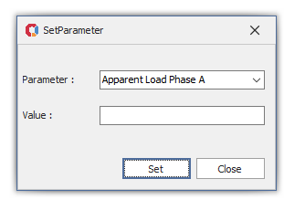

# SetPrameterWinFrom
RevitAPISample WinForm

Content :
- Introduction RevitAPI 
- Set Parameter Value Sample
- Binding Data 
- Create App
- IExternalCommand
- IExternalApplication
- INotifyPropertyChanged
- External Event Hander

Demo :

Many Thanks <a href="https://github.com/DevExpress" target="_blank">DevExpress</a> 
